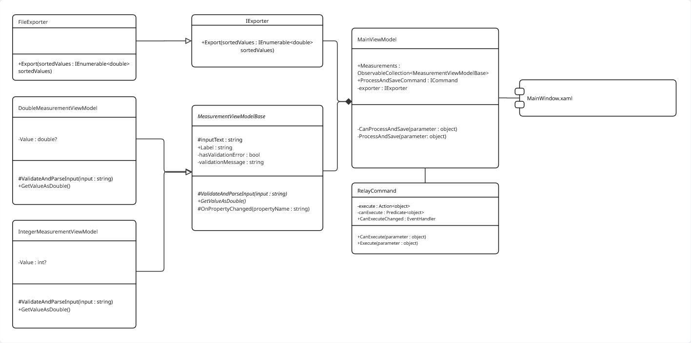

# Patienten-Messwerte

## Zweck

Grafische Oberfläche zur Eingabe, Validierung, Sortierung und Speicherung von Patienten-Messwerten.

## Ausführung

---
1. Öffnen Sie die Lösung `App2.sln` in Visual Studio.
2. Legen Sie das Startprojekt auf `App2` fest.
3. Führen Sie die Anwendung aus (F5).
4. Geben Sie die Messwerte ein und klicken Sie auf „Verarbeiten und speichern“.
5. Überprüfen Sie das Benutzerverzeichnis auf die Datei `values.txt`, die die sortierten Messwerte enthält.

## Funktionalitäten

* Eingabe von drei Patienten-Messwerten (zwei Gleitkommazahlen, eine Ganzzahl).
* Echtzeit-Validierung der Benutzereingaben.
* Sortierung der Messwerte in aufsteigender Reihenfolge.
* Speicherung der Messwerte in einer Textdatei (werte.txt) im Benutzerverzeichnis.
* Fehlerbehandlung für unerwartete Fehler während des Speichervorgangs.#


## Architektur



## Klassen

### IExporter (Service)

Definiert eine Schnittstelle mit einer Methode `Export(IEnumerable<double> sortedValues)` für den Export von Messwerten.

- Methoden: `void Export(IEnumerable<double> sortedValues)`
- Implementierungen: `FileExporter`, `ConsoleExporter`

### MeasurementViewModelBase (ViewModels)

Die abstrakte Basisklasse welche eine Schnittstelle für die Validierung von Eingaben bereitstellt. Sie implementiert INotifyPropertyChanged.

- Eigenschaften: `string Label`, `string InputText`, `string HasValidationError`, `string ValidationMessage`.
- Methoden: `void ValidateAndParseInput(string input)`, `double GetValueAsDouble()`.
- Implementierungen : `DoubleMeasurementViewModel` ,` IntegerMeasurementViewModel`

### MainViewModel (ViewModels)

Haupt-ViewModel, das als DataContext für `MainWindows.xaml` dient. Hält die Logik für die Benutzerinteraktion und die darzustellenden Messwerte für die View.

- Eigenschaften: `ObservableCollection<MeasurementViewModelBase> Measurements`, `ICommand ProcessAndSaveCommand`, `IExporter exporter`.
- Methoden: `ProcessAndSave()`, `CanProcessAndSave()`

### RelayCommand (ViewModels/MainViewModel)
Kapselung von Methoden als ICommands, die für die WPF-View-Bindung notwendig ist.

## Erweiterbarkeit

### Neue Exportziele hinzufügen:
```csharp
//Services/IExporter.cs
    public interface IExporter
    {
        void Export(IEnumerable<double> sortedValues);
    }
```
```csharp
//Services/
    class MyCustomExporter: IExporter
    {
        public void Export(IEnumerable<double> sortedValues)
        {
            //... Custom export logic
        }
    }
```
### Exportziel ändern: 
```csharp
//ViewModels/MainViewModel.cs
        public MainViewModel()
        {
            
            _exporter = new MyCustomExporter();
            
            //...

        }
```


### Neue Messwerttypen hinzufügen: 
```csharp
//ViewModels/MeasurementViewModelBase.cs
    public abstract class MeasurementViewModelBase : INotifyPropertyChanged
    {
        //...
        public abstract bool ValidateAndParseInput();
        public abstract double GetValueAsDouble();
    }
```
```csharp
//ViewModels/
    class MyCustomMeasurementViewModel : MeasurementViewModelBase
    {
        public override bool ValidateAndParseInput()
        {
            //... Custom validation logic
        }

        public override double GetValueAsDouble()
        {
            //... Custom conversion logic
        }
    }
```

###### Entwickelt im Rahmen einer Bewerberaufgabe für Carl Zeiss Meditec AG.